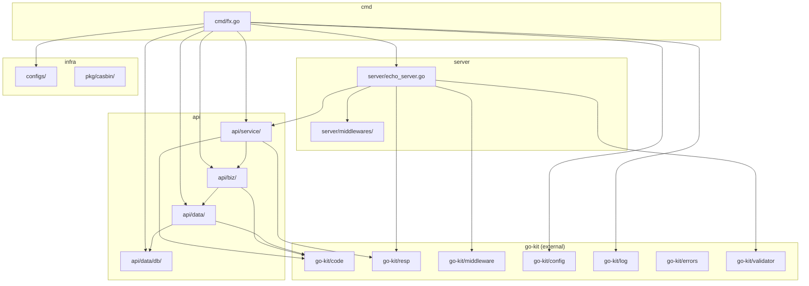

<!-- OPENSPEC:START -->
# OpenSpec Instructions

These instructions are for AI assistants working in this project.

Always open `@/openspec/AGENTS.md` when the request:
- Mentions planning or proposals (words like proposal, spec, change, plan)
- Introduces new capabilities, breaking changes, architecture shifts, or big performance/security work
- Sounds ambiguous and you need the authoritative spec before coding

Use `@/openspec/AGENTS.md` to learn:
- How to create and apply change proposals
- Spec format and conventions
- Project structure and guidelines

Keep this managed block so 'openspec update' can refresh the instructions.

<!-- OPENSPEC:END -->

# Repository Development Notes

This project is a Go web application scaffold based on the Echo framework. It follows clean architecture principles with clear separation between Service, Biz, and Data layers. The project leverages `github.com/NSObjects/go-kit` for common infrastructure including error handling, middleware, logging, config management and response formatting.

## Project Structure

```
.
├── cmd/                          # Application entry points
│   ├── fx.go                     # Fx application bootstrap
│   ├── gen.go                    # Code generation commands
│   └── root.go                   # Cobra root command
├── configs/                      # Configuration files
│   └── config.yaml               # Application configuration
├── internal/                     # Private application code
│   ├── api/                      # API layers
│   │   ├── biz/                  # Business logic layer
│   │   │   ├── biz.go            # Fx module registration
│   │   │   └── user.go           # User business logic
│   │   ├── data/                 # Data access layer
│   │   │   ├── data.go           # Fx module registration
│   │   │   ├── user.go           # User repository implementation
│   │   │   ├── db/               # Database infrastructure
│   │   │   │   ├── db.go         # DataManager and Fx module
│   │   │   │   ├── mysql.go      # MySQL connection
│   │   │   │   ├── redis.go      # Redis connection
│   │   │   │   ├── mongodb.go    # MongoDB connection
│   │   │   │   └── kafka.go      # Kafka connection
│   │   │   ├── model/            # GORM models (auto-generated)
│   │   │   └── query/            # GORM Gen query builders (auto-generated)
│   │   └── service/              # HTTP handlers layer
│   │       ├── service.go        # Fx module registration
│   │       ├── user.go           # User controller
│   │       └── param/            # Request/Response DTOs
│   ├── code/                     # Application error codes
│   │   └── code.go               # Error code wrapping (uses go-kit/code)
│   ├── configs/                  # Configuration types
│   │   └── config.go             # AppConfig struct
│   ├── model/                    # Shared data models
│   ├── pkg/                      # Internal packages
│   │   └── casbin/               # Casbin authorization setup
│   ├── server/                   # HTTP server
│   │   ├── echo_server.go        # Echo server setup with middlewares
│   │   ├── config.go             # Server configuration
│   │   └── middlewares/          # Echo middlewares
│   └── types/                    # Shared types
│       ├── jwt.go                # JWT claims types
│       ├── param.go              # Common request parameters
│       └── user.go               # User-related types
├── muban/                        # Code generation tools
│   ├── codegen/                  # Error code generator
│   ├── modgen/                   # Module generator
│   ├── project/                  # Project template generator
│   └── newcmd/                   # Command generator
├── main.go                       # Application entry
└── Makefile                      # Build and dev commands
```

## Core Dependencies

| Package | Usage |
|---------|-------|
| `github.com/NSObjects/go-kit` | Core library: config, errors, code, middleware, resp, log, validator |
| `go.uber.org/fx` | Dependency injection framework |
| `github.com/labstack/echo/v4` | HTTP web framework |
| `gorm.io/gorm` + `gorm.io/gen` | ORM and query builder |
| `github.com/casbin/casbin/v2` | Authorization library |

## Layer Responsibilities

### Service Layer (`internal/api/service`)
**Responsibility**: Transport layer handlers and request/response translation
- Perform syntactic validation via `BindAndValidate`, bind request parameters
- Convert business responses into unified `resp` envelope format
- **Prohibited**: Embed business rules or persistence logic

**Correct Example**:
```go
func (c *UserController) Create(ctx echo.Context) error {
    var req param.UserCreateRequest
    if err := BindAndValidate(ctx, &req); err != nil {
        return err  // Return directly, handled by ErrorHandler middleware
    }

    bizCtx := utils.BuildContext(ctx)
    err := c.user.Create(bizCtx, req)
    if err != nil {
        return err  // Return directly, handled by ErrorHandler middleware
    }

    return resp.OperateSuccess(ctx)  // Use unified response format
}

func (c *UserController) ListUsers(ctx echo.Context) error {
    var req param.UserListUsersRequest
    if err := BindAndValidate(ctx, &req); err != nil {
        return err
    }

    bizCtx := utils.BuildContext(ctx)
    list, total, err := c.user.ListUsers(bizCtx, req)
    if err != nil {
        return err
    }

    return resp.ListDataResponse(ctx, list, total)  // Use list response format
}
```

**Incorrect Example**:
```go
// ❌ Wrong: Direct database operations in Service layer
func (c *UserController) Create(ctx echo.Context) error {
    var user model.User
    if err := c.db.Create(&user).Error; err != nil {
        return err
    }
    return ctx.JSON(200, user)  // ❌ Wrong: Not using unified response format
}

// ❌ Wrong: Business logic processing in Service layer
func (c *UserController) Create(ctx echo.Context) error {
    var req param.UserCreateRequest
    if err := BindAndValidate(ctx, &req); err != nil {
        return err
    }

    // ❌ Wrong: Business logic should be in biz layer
    if req.Age < 18 {
        return errors.New("age must be greater than 18")
    }

    return c.user.Create(ctx, req)
}
```

### Biz Layer (`internal/api/biz`)
**Responsibility**: Encapsulate domain workflows and business invariants while staying storage-agnostic
- Coordinate repository interfaces, handle branching logic (e.g., rate limits, token rotation)
- Return rich error values using `go-kit/code` package
- Inject dependencies through constructors, avoid direct dependency on `DataManager`

**Correct Example**:
```go
// Define Repository interface near the caller
type UserRepository interface {
    ListUsers(ctx context.Context, req param.UserListUsersRequest) ([]param.UserListItem, int64, error)
    Create(ctx context.Context, req param.UserCreateRequest) error
    GetByID(ctx context.Context, id int64) (param.UserData, error)
    Update(ctx context.Context, id int64, req param.UserUpdateRequest) error
    Delete(ctx context.Context, id int64) error
}

// UserHandler injects Repository through constructor
type UserHandler struct {
    repo UserRepository
}

func NewUserHandler(repo UserRepository) UserUseCase {
    return &UserHandler{repo: repo}
}

func (h *UserHandler) Create(ctx context.Context, req param.UserCreateRequest) error {
    // Business rule validation
    if err := h.validateUserData(req); err != nil {
        return code.WrapValidationError(err, "user data validation failed")
    }

    err := h.repo.Create(ctx, req)
    if err != nil {
        return code.WrapDatabaseError(err, "create user failed")
    }
    return nil
}
```

**Incorrect Example**:
```go
// ❌ Wrong: Direct dependency on DataManager
type UserHandler struct {
    dm *db.DataManager  // ❌ Wrong: Should inject through Repository interface
}

func (h *UserHandler) Create(ctx context.Context, req param.UserCreateRequest) error {
    // ❌ Wrong: Direct database operations in Biz layer
    var user model.User
    if err := h.dm.MySQLWithContext(ctx).Create(&user).Error; err != nil {
        return err  // ❌ Wrong: Not using code package to wrap errors
    }
    return nil
}
```

### Data Layer (`internal/api/data`)
**Responsibility**: Implement concrete persistence adapters and external integrations
- Expose clear interfaces that can be mocked
- Implement Repository interfaces defined in biz layer
- Use `code` package to wrap database errors

**Correct Example**:
```go
type userRepository struct {
    d *db.DataManager
}

func NewUserRepository(d *db.DataManager) biz.UserRepository {
    return userRepository{d: d}
}

func (u userRepository) Create(ctx context.Context, req param.UserCreateRequest) error {
    user := model.User{
        Username:  req.Username,
        Email:     req.Email,
        Age:       int32(req.Age),
        CreatedAt: time.Now(),
        UpdatedAt: time.Now(),
    }

    err := u.d.Query.User.WithContext(ctx).Create(&user)
    if err != nil {
        return code.WrapDatabaseError(err, "create user failed")
    }

    return nil
}
```

**Incorrect Example**:
```go
// ❌ Wrong: Business logic processing in Data layer
func (u userRepository) Create(ctx context.Context, req param.UserCreateRequest) error {
    // ❌ Wrong: Business logic should be in biz layer
    if req.Age < 18 {
        return errors.New("age must be greater than 18")
    }
    // Database operations...
}
```

## go-kit Integration

This project heavily relies on `github.com/NSObjects/go-kit` for infrastructure:

### Error Handling (`go-kit/code` + `go-kit/errors`)
```go
import (
    "github.com/NSObjects/go-kit/code"
    "github.com/NSObjects/go-kit/errors"
)

// Wrap errors with error codes
return code.WrapDatabaseError(err, "query user failed")
return code.WrapValidationError(err, "validation failed")
return code.WrapNotFoundError(err, "user not found")

// Use WrapCode for custom error codes
return errors.WrapCode(err, code.ErrPermissionDenied, "权限检查失败")
```

### Response Formatting (`go-kit/resp`)
```go
import "github.com/NSObjects/go-kit/resp"

// List data response
return resp.ListDataResponse(ctx, list, total)

// Single data response
return resp.OneDataResponse(ctx, data)

// Operation success response
return resp.OperateSuccess(ctx)

// Custom success response
return resp.SuccessJSON(ctx, result)
```

All responses conform to:
```json
{
  "msg": "string",
  "code": 0,
  "data": { ... }
}
```

### Middleware (`go-kit/middleware`)
```go
import kitmiddleware "github.com/NSObjects/go-kit/middleware"

// Error handler - converts errors to JSON response
s.server.HTTPErrorHandler = kitmiddleware.ErrorHandler

// Recovery middleware
s.server.Use(kitmiddleware.Recovery())

// Request logger
s.server.Use(kitmiddleware.RequestLogger())

// JWT middleware
s.server.Use(kitmiddleware.JWT(jwtConfig))

// Casbin middleware
s.server.Use(kitmiddleware.Casbin(enforcer, casbinConfig))
```

### Configuration (`go-kit/config`)
```go
import kitconfig "github.com/NSObjects/go-kit/config"

// Bootstrap configuration with hot-reload support
merged, store := kitconfig.Bootstrap[configs.AppConfig](cfg)

// Access current config
current := store.Current()
```

### Logging (`go-kit/log`)
```go
import "github.com/NSObjects/go-kit/log"

// Create logger
sink := log.NewConsoleSink(log.ConsoleSinkConfig{
    Format: "color",
    Output: "stdout",
})
logger := log.NewDefaultLogger(sink, slog.LevelInfo)
log.SetGlobalLogger(logger)

// Use logger
logger.Info("message", slog.String("key", "value"))
```

### Validation (`go-kit/validator`)
```go
import "github.com/NSObjects/go-kit/validator"

// Set Echo validator
s.server.Validator = validator.New()
```

## Coding Conventions

### Dependency Injection with Fx
- Favor composition over shared state
- Inject dependencies via constructors
- Use Go interfaces that describe behaviors needed by the caller

```go
// Fx module registration pattern
var Model = fx.Options(fx.Provide(NewUserController))

// AsRoute helper for route registration
func AsRoute(f any) any {
    return fx.Annotate(
        f,
        fx.As(new(RegisterRouter)),
        fx.ResultTags(`group:"routes"`),
    )
}
```

### Error Handling Standards
- Wrap domain failures with helpers from `go-kit/code` package
- Service layer returns errors directly (ErrorHandler middleware handles conversion)
- Success responses must use `resp` package methods

### File Organization
- Organize files by concern: new business logic beside generated scaffolding
- Shared helpers in dedicated packages
- Use context-aware functions for operations needing cancellation/tracing
- Handle secrets via configuration structs

## Module Dependency Graph



## Fx Module Registration

| Module Name | Package | Responsibility |
|-------------|---------|----------------|
| `config` | `go-kit/config` + `internal/configs` | Configuration loading with hot-reload |
| `log` | `go-kit/log` | Structured logging with slog |
| `db` | `internal/api/data/db` | DataManager (MySQL/Redis/Kafka/Mongo via GORM Gen) |
| `casbin` | `internal/pkg/casbin` | Casbin enforcer for authorization |
| `biz` | `internal/api/biz` | Business logic handlers |
| `data` | `internal/api/data` | Repository implementations |
| `service` | `internal/api/service` | HTTP controllers |
| `server` | `internal/server` | Echo HTTP server with middleware |

## Command Reference

### Development

| Command | Description |
|---------|-------------|
| `make run` | Start development server |
| `make build` | Build binary |
| `make test` | Run all tests |
| `make test-coverage` | Run tests with coverage report |
| `make lint` | Run golangci-lint |
| `make fmt` | Format code with gofmt |

### Code Generation

| Command | Description |
|---------|-------------|
| `make gen` | Run all code generators |
| `make gen-query` | Generate GORM Gen query code |
| `make gen-api` | Generate API code from OpenAPI spec |
| `go generate ./internal/code/...` | Regenerate error code files |

### Database

| Command | Description |
|---------|-------------|
| `make migrate-up` | Apply database migrations |
| `make migrate-down` | Rollback last migration |
| `make migrate-create NAME=xxx` | Create new migration |

### Docker

| Command | Description |
|---------|-------------|
| `make docker-build` | Build Docker image |
| `make docker-up` | Start services with docker-compose |
| `make docker-down` | Stop services |

## Auto-Generated Files

> ⚠️ **WARNING**: Do NOT manually edit these files. They will be overwritten.

| Path Pattern | Generator | Description |
|--------------|-----------|-------------|
| `internal/api/data/query/*.go` | GORM Gen | Database query builders |
| `internal/api/data/model/*.go` | GORM Gen | Database model structs |
| `internal/code/*_generated.go` | `muban/codegen` | Error code registration |
| `internal/code/error_code_generated.md` | `muban/codegen` | Error code documentation |

### Safe to Extend

| Path | Description |
|------|-------------|
| `internal/api/biz/*.go` | Add custom business logic |
| `internal/api/data/*.go` | Add custom repository methods |
| `internal/api/service/*.go` | Add custom handlers |
| `internal/code/*.go` | Add domain-specific error codes |

## Testing Expectations

- Write table-driven tests for new logic
- Service layer tests: exercise request binding and response envelopes
- Biz layer tests: mock repositories to cover edge cases
- Data layer tests: use test databases for integration testing
- Run `go test ./...` before submitting changes

## Code Review Checklist

When reviewing code, ensure:

- [ ] Service layer only contains request binding, validation, and response formatting
- [ ] Biz layer accesses data through Repository interfaces
- [ ] Data layer implements Repository interfaces from biz layer
- [ ] All errors wrapped using `go-kit/code` or `go-kit/errors` package
- [ ] All success responses use `go-kit/resp` package methods
- [ ] Dependencies injected through constructors, not global variables
- [ ] Interface definitions near callers (biz layer), implementations in data layer
- [ ] Context properly passed in all operations
- [ ] Business rule validation in Biz layer
- [ ] Data conversion in Data layer, not leaking transport concepts