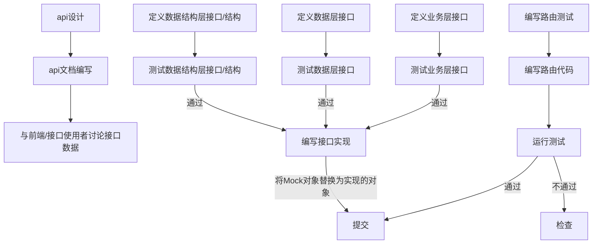

### Api 项目实践流程

---

#### 代码编写从最外层向最里层实现 服务->业务->数据，具体流程如下

* 服务层层文件 - service
* 业务层文件 - biz
* 数据层文件 - data




### mock 文档

https://github.com/golang/mock

### sqlmock 文档

https://github.com/DATA-DOG/go-sqlmock

### echo 对http接口测试文档

https://echo.labstack.com/guide/testing

```
.
├── Dockerfile
├── Makefile
├── README.md
├── cmd
│   ├── dig.go
│   └── main.go
├── configs
│   └── config.toml
├── doc
│   └── openapi.yaml
├── docker-compose.yaml
├── go.mod
├── go.sum
└── internal
    ├── api
    │   ├── biz
    │   │   ├── Makefile
    │   │   ├── mock
    │   │   │   └── user.go
    │   │   ├── user.go
    │   │   ├── user_test.go
    │   │   └── usercase.go
    │   ├── data
    │   │   ├── Makefile
    │   │   ├── data.go
    │   │   ├── db
    │   │   │   ├── db.go
    │   │   │   ├── db_test.go
    │   │   │   ├── mongodb.go
    │   │   │   ├── mongodb_test.go
    │   │   │   ├── mysql.go
    │   │   │   └── redis.go
    │   │   ├── mock
    │   │   ├── model
    │   │   │   ├── time.go
    │   │   │   └── user.go
    │   │   ├── user.go
    │   │   └── user_test.go
    │   ├── server
    │   │   ├── echo_server.go
    │   │   └── middlewares
    │   │       ├── middleware.go
    │   │       └── middleware_test.go
    │   └── service
    │       ├── param
    │       │   ├── param.go
    │       │   └── user.go
    │       ├── service.go
    │       ├── user.go
    │       └── user_test.go
    ├── configs
    │   ├── config.go
    │   └── config_test.go
    ├── log
    │   ├── log.go
    │   └── log_test.go
    └── resp
        ├── api_error.go
        ├── api_error_test.go
        ├── response.go
        ├── response_test.go
        └── status_code.go

```
