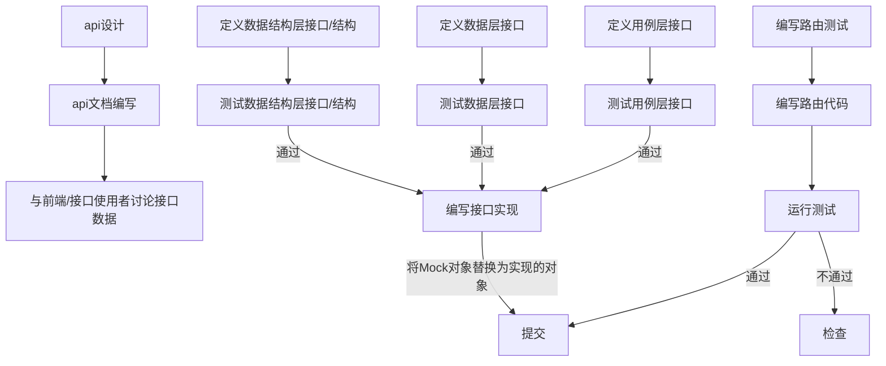

### Api 项目实践流程

---

#### 代码编写从最外层向最里层实现 路由->用例->数据层->数据结构，具体流程如下

* 路由层文件 - api
* 用例层文件 - ucase
* 数据层文件 - repository
* 数据结构层文件 - models

```mermaid
graph TD;
api设计-->api文档编写;
api文档编写-->与前端/接口使用者讨论接口数据;

编写路由测试-->编写路由代码;
编写路由代码-->运行测试;
运行测试-->|通过|提交;
运行测试-->|不通过|检查;

定义用例层接口-->测试用例层接口;
测试用例层接口-->|通过|编写接口实现;

定义数据层接口-->测试数据层接口;
测试数据层接口-->|通过|编写接口实现;
  
定义数据结构层接口/结构-->测试数据结构层接口/结构;
测试数据结构层接口/结构-->|通过|编写接口实现;

编写接口实现-->|将Mock对象替换为实现的对象|提交;
```

### mock 文档

https://github.com/golang/mock

### sqlmock 文档

https://github.com/DATA-DOG/go-sqlmock

### echo 对http接口测试文档

https://echo.labstack.com/guide/testing

